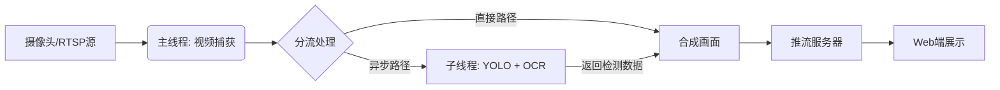

# 性能优化与架构重构 (v1)

**日期**：2026-01-24

---

## 背景与问题分析

在之前的版本中，直播系统存在以下性能瓶颈：

- **串行阻塞**：由于在主线程中同时串行执行 YOLO（目标检测）和 OCR（文字识别），导致处理耗时过长。OCR 的推理速度较慢，阻塞了视频帧的读取和推送。

- **高延迟**：显著的视频卡顿与画面模糊和高达 1-2 秒的延迟，无法满足实时性要求。

以及繁琐的配置：

- **配置前端网页**：需要在前端指定websocket的地址以接收图片流。
- **python-opencv还需要同时处理网络请求**：python脚本负责接收rtsp流，处理图像，生成每一帧处理后的图像，然后通过fastapi生成websocket服务和前端建立长连接。

还有OCR检测问题:

- easyocr对中文识别能力较弱

## 优化方案核心

为了解决延迟问题，本方案从软件架构和传输链路两个维度进行了重构：

### 1. 软件：多线程异步处理

 **主线程 (采集/推流)**：

- 专注于 RTSP 视频流的读取与最终画面的推流，确保视频流本身不丢帧、不卡顿。

``` python
while True:
    ret, frame = self.cap.read()
```

**子线程 (YOLO & OCR)**：

- 独立运行检测算法，不直接阻塞主画面。
- 仅对关键帧或缓冲区内的帧进行异步处理。
- 将处理结果（坐标、文字）通过队列（Queue）回调给主线程进行绘制。

``` python
yolo_thread = Thread(target=self.yolo_worker, daemon=True, name="YOLO")
ocr_thread = Thread(target=self.ocr_worker, daemon=True, name="PaddleOCR")
yolo_thread.start()
ocr_thread.start()
```

**PaddleOCR**：

- V5对实时图像识别能力较强，且非常支持中文。

### 2. 链路：流媒体服务更换

- 更换了推流中间件服务器（MediaMTX）。可以直接转换rtsp协议为webrtc协议供网页访问。

```docker
docker run --rm -it \
-e MTX_RTSPTRANSPORTS=tcp \
-e MTX_WEBRTCADDITIONALHOSTS=192.168.x.x \
-p 8554:8554 \
-p 1935:1935 \
-p 8888:8888 \
-p 8889:8889 \
-p 8890:8890/udp \
-p 8189:8189/udp \
bluenviron/mediamtx:1-ffmpeg
```

- 优化了 RTSP/WebRTC 的传输配置，减少了中间环节的缓冲延迟（直接去除了WebSocket在其中的转发jpeg角色）。

## 系统数据流向图

> 优化后的处理逻辑如下：



## 优化结果

经过测试，系统性能提升显著：

- 端到端延迟：由原本的2s乃至卡顿降低到500ms左右（与基本的rtsp流传输所需的延迟相差无几，几乎等于rtsp本身延迟+opencv处理图像延迟）
- 流畅度：OCR识别过程不在导致画面卡顿，视频播放平滑。

## 后续可能的修改

- OCR检测耗时较长，一次检测耗时大概1000ms。
