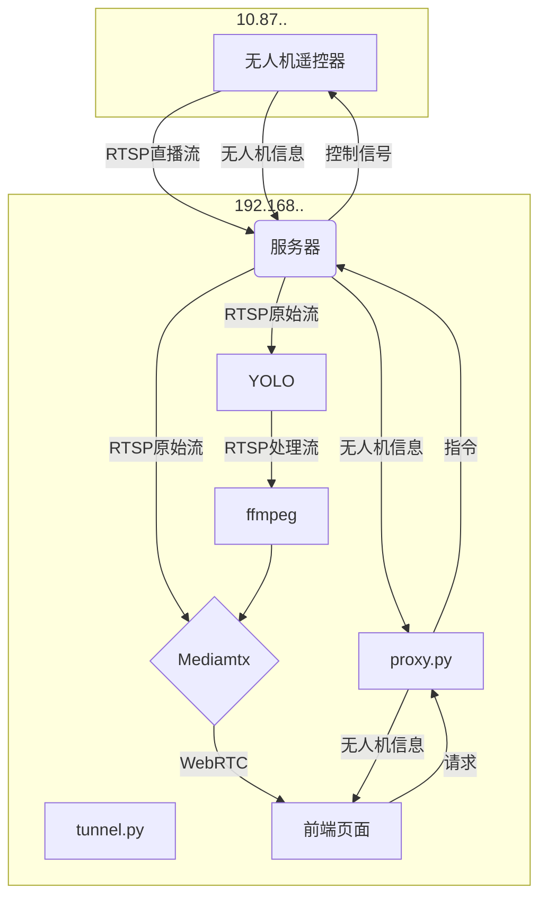

#

```mermaid
graph
    subgraph 10.87..
    A
    end
    subgraph 192.168..
    F[tunnel.py]
    B
    A[无人机遥控器] --RTSP直播流--> B
    B(服务器) --控制信号--> A
    A --无人机信息--> B
    E[proxy.py] --指令--> B
    B --无人机信息--> E
    B --RTSP原始流--> C{Mediamtx} & G[YOLO]
    G --RTSP处理流--> H[ffmpeg] --> C
    
    C --WebRTC--> D[前端页面] 
    D --请求--> E
    E --无人机信息--> D
   
    end

```
